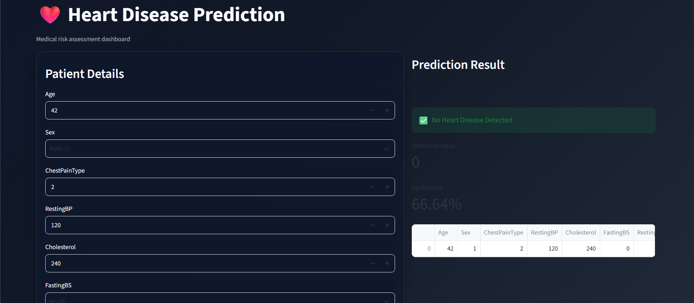

# Heart Failure Prediction Project

This project is a simple machine learning web app for predicting heart disease using patient health features.

---


---
## Overview

The app loads a trained ML model saved in a joblib file and predicts whether a patient is likely to have heart disease based on input values such as:

- Age
- Sex
- Chest Pain Type
- Resting Blood Pressure
- Cholesterol
- Fasting Blood Sugar
- Resting ECG
- Max Heart Rate
- Exercise Angina
- Oldpeak
- ST_Slope

## Project Structure

```text
Heart Failure Prediction Dataset/
├── app.py
├── model.pkl              # optional model file name
├── model (2).pkl          # current model file in this project
├── .venv/
├── README.md
└── requirements.txt      # optional, if you create it later
```

## Requirements

- Python 3.9+
- pip
- Streamlit
- pandas
- joblib

## Setup

1. Open PowerShell in the project folder.
2. Create a virtual environment:

```powershell
python -m venv .venv
```

3. Activate the environment:

```powershell
.\.venv\Scripts\Activate.ps1
```

4. Upgrade pip:

```powershell
python -m pip install --upgrade pip
```

5. Install dependencies:

```powershell
python -m pip install streamlit pandas joblib scikit-learn
```

## Run the App

From the project folder:

```powershell
python -m streamlit run app.py
```

Then open the browser at:

```text
http://localhost:8501
```

## Model File

The app is designed to load either of these files if present:

- model.pkl
- model (2).pkl

This helps if the model was saved with a different filename.

## Example Prediction Script

```python
import joblib

inp = [[42, 1, 2, 120, 240, 1, 1, 194, 0, 0.8, 0]]
loaded_model = joblib.load('model.pkl')
prediction = loaded_model.predict(inp)
print(f"Prediction: {prediction[0]}")
```

## Notes

- The app expects the input order to match the trained model exactly.
- If your model was trained on a different feature order, prediction results may be wrong.
- If `streamlit` is not recognized, install it using:

```powershell
python -m pip install streamlit
```

## Troubleshooting

### 1. `app.py` is not recognized

Use:

```powershell
python app.py
```

For the Streamlit app, use:

```powershell
python -m streamlit run app.py
```

### 2. `model.pkl` not found

Check whether the model file exists in the project folder. If the file name is different, rename it to `model.pkl` or update the code accordingly.

### 3. `streamlit` not installed

```powershell
python -m pip install streamlit
```

## License

This project is for educational and learning purposes.
